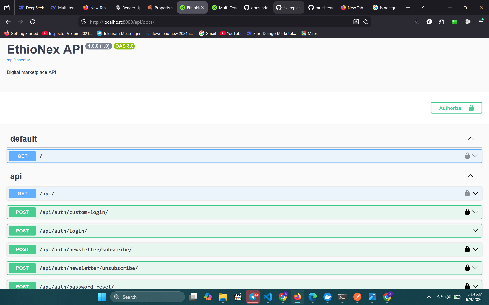
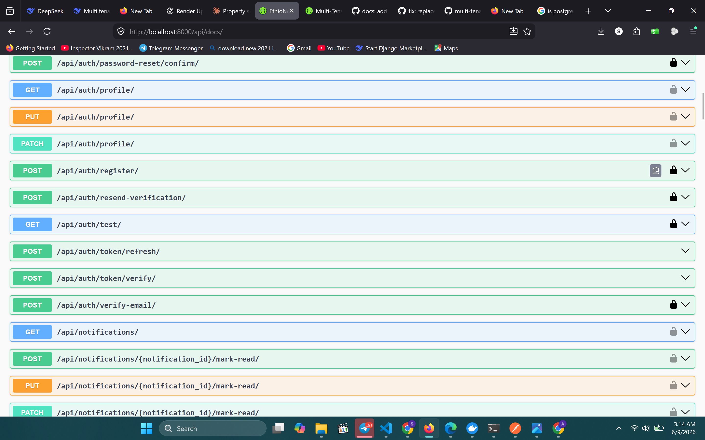
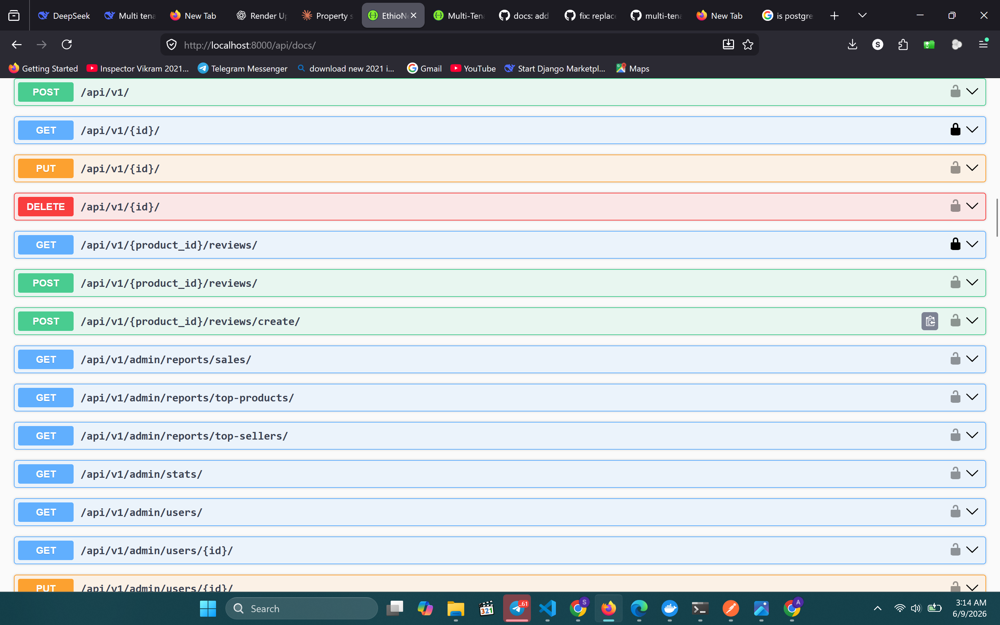
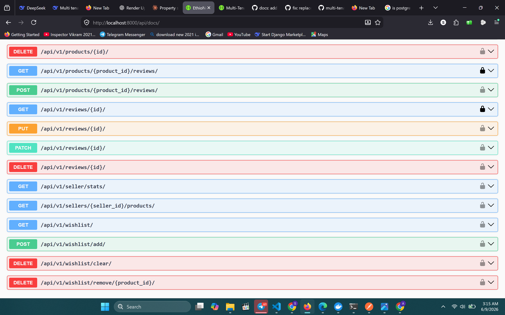

# EthioNex API — Multi-Vendor Marketplace


- 321 automated tests
- 83% code coverage
- Unit + integration + performance test layers
- 0 failed tests
- Order state machine tests included
- Inventory atomic operation tests included
- Rate limiting and caching benchmark tests included

## 📸 API Documentation Preview

> Full interactive documentation available at `/api/docs/` — supports JWT authentication directly in the browser.

### Overview & Authentication


### Products & Orders


### Dashboards & Analytics


### Notifications & Tracking

## 📊 Quality Metrics


> A production-ready multi-vendor e-commerce marketplace REST API — buyers browse and place orders, sellers manage inventory and track revenue, admins oversee the platform. Built with Django REST Framework, PostgreSQL, Redis, Celery, Django Channels (WebSockets), and Docker.

---

## ⚡ Why EthioNex?

Most portfolio APIs are CRUD wrappers. EthioNex handles real production concerns:

| Challenge | Solution |
|-----------|----------|
| Race conditions on stock | `select_for_update()` inside atomic transactions |
| Order integrity | Explicit state machine with validated transitions |
| Email blocking HTTP | All emails dispatched as Celery background tasks |
| Cache staleness | Structured cache keys with immediate write invalidation |
| Real-time tracking | WebSocket rooms with ownership verification |
| Auth security | JWT rotation + blacklisting + rate limiting |

---

## 🚀 Key Features

### 🔐 Authentication & Security
- JWT access + refresh tokens with rotation and blacklisting
- Email verification with 24-hour expiring tokens
- Password reset via secure one-time links
- Rate limiting: login (5/min), register (3/min), orders (10/min)

### 🛒 Product & Inventory
- Product listings with search, filtering, and ordering
- Redis-backed caching on list and detail endpoints
- Immediate cache invalidation on any write operation
- Atomic stock reservation with `select_for_update()` to prevent overselling
- Low stock alerts sent to sellers via Celery

### 📦 Order Management
- Strict state machine: `pending → paid → processing → shipped → delivered`
- Stock automatically restored on cancellation
- Full status history log with actor, timestamp, and reason
- Public order tracking by order number or tracking number
- Bulk status updates for admin

### 🔔 Real-Time
- WebSocket notifications via Django Channels
- Per-user notification rooms with mark-as-read support
- Per-order tracking rooms with ownership verification

### ⚙️ Background Tasks
- Welcome, verification, password reset, and order confirmation emails
- Seller new-order notifications
- Expired cart cleanup (30-day threshold)

### 📊 Dashboards
- **Seller**: product count, order stats, revenue breakdown
- **Admin**: user analytics, top products, top sellers, daily sales reports

---

## 🛠 Tech Stack

| Layer | Technology |
|-------|-----------|
| Backend | Django 5.2, Django REST Framework 3.15 |
| Database | PostgreSQL 16 |
| Cache & Broker | Redis 7 |
| Authentication | JWT (djangorestframework-simplejwt) |
| Background Tasks | Celery + Redis |
| Real-Time | Django Channels + WebSockets |
| API Docs | drf-spectacular (Swagger + ReDoc) |
| Testing | pytest, pytest-django, pytest-cov |
| Containerization | Docker, Docker Compose |

---

## 🏗 Architecture

Client → Django REST API (Gunicorn)
↓              ↓
PostgreSQL         Redis
(Primary DB)  (Cache + Broker)
↓
Celery Workers
Django Channels
---

## 📁 Project Structure
ethionex-api/
├── users/               # Auth, registration, password reset, newsletter
├── products/            # Products, categories, reviews, wishlist
├── cart/                # Shopping cart
├── orders/              # Order management, state machine, tracking
│   ├── state_machine.py # Validated transitions + status logging
│   ├── services.py      # InventoryService (atomic stock ops)
│   └── tracking_views.py
├── notifications/       # WebSocket consumers, EmailService, Celery tasks
├── dashboard/           # Seller dashboard
├── admin_dashboard/     # Admin analytics and user management
├── audit/               # Request logging middleware
└── utils/               # CacheService, cache keys, logging config

---

## 📡 API Endpoints

### Authentication

| Method | Endpoint | Description | Auth |
|--------|----------|-------------|------|
| POST | `/api/v1/auth/register/` | Register with email verification | Public |
| POST | `/api/v1/auth/login/` | Login, receive JWT tokens | Public |
| POST | `/api/v1/auth/verify-email/` | Verify email with token | Public |
| POST | `/api/v1/auth/resend-verification/` | Resend verification email | Public |
| POST | `/api/v1/auth/password-reset/` | Request password reset link | Public |
| POST | `/api/v1/auth/password-reset/confirm/` | Confirm reset with token | Public |
| GET/PATCH | `/api/v1/auth/profile/` | View and update profile | JWT |

### Products

| Method | Endpoint | Description | Auth |
|--------|----------|-------------|------|
| GET | `/api/v1/products/` | List products (cached, filterable) | Public |
| POST | `/api/v1/products/` | Create product | Seller |
| GET | `/api/v1/products/<id>/` | Product detail (increments views) | Public |
| PATCH/DELETE | `/api/v1/products/<id>/` | Update or delete own product | Seller |
| GET/POST | `/api/v1/products/<id>/reviews/` | List or create review | Public/JWT |
| POST | `/api/v1/wishlist/add/` | Add product to wishlist | JWT |
| DELETE | `/api/v1/wishlist/clear/` | Clear entire wishlist | JWT |

### Cart & Orders

| Method | Endpoint | Description | Auth |
|--------|----------|-------------|------|
| GET/POST | `/api/v1/cart/` | View or add to cart | JWT |
| GET/POST | `/api/v1/orders/` | List orders / create from cart | JWT |
| GET/PUT | `/api/v1/orders/<order_number>/` | Order detail / cancel pending | JWT |
| PATCH | `/api/v1/orders/<order_number>/` | Update order status | Admin |
| GET | `/api/v1/orders/track/` | Public tracking by order number | Public |
| POST | `/api/v1/orders/admin/bulk-update/` | Bulk order status update | Admin |

### Dashboards

| Method | Endpoint | Description | Auth |
|--------|----------|-------------|------|
| GET | `/api/v1/seller/stats/` | Seller analytics | Seller |
| GET | `/api/v1/admin/stats/` | Platform overview stats | Admin |
| GET | `/api/v1/admin/reports/sales/` | Daily sales report | Admin |
| GET | `/api/v1/admin/reports/top-products/` | Top products by units sold | Admin |
| GET | `/api/v1/admin/reports/top-sellers/` | Top sellers by revenue | Admin |

### Real-Time (WebSocket)

| Type | Endpoint | Description | Auth |
|------|----------|-------------|------|
| WS | `ws://.../ws/notifications/` | Real-time notification stream | JWT |
| WS | `ws://.../ws/orders/<id>/track/` | Real-time order tracking | JWT (owner) |

---

## 💡 Example API Usage

**Register and get JWT token:**
```bash
curl -X POST http://localhost:8000/api/v1/auth/register/ \
  -H "Content-Type: application/json" \
  -d '{
    "email": "buyer@example.com",
    "username": "testbuyer",
    "password": "securepass123",
    "password2": "securepass123"
  }'
```

**Browse products:**
```bash
curl http://localhost:8000/api/v1/products/?search=laptop&ordering=-price
```

**Place an order:**
```bash
curl -X POST http://localhost:8000/api/v1/orders/ \
  -H "Authorization: Bearer <your_access_token>" \
  -H "Content-Type: application/json" \
  -d '{
    "payment_method": "cash",
    "full_name": "Andualem Getachew",
    "phone_number": "0923069966",
    "address": "Bole Road",
    "city": "Addis Ababa"
  }'
```

**Track an order:**
```bash
curl http://localhost:8000/api/v1/orders/track/?order_number=ORD-20260608-0001
```

---

## 🧪 Testing

```bash
# Run full test suite inside Docker
docker-compose exec web pytest --tb=short -q

# With coverage report
docker-compose exec web pytest --cov=. --cov-report=term-missing

# Run a specific module
docker-compose exec web pytest tests/unit/test_state_machine.py -v
```

### ✅ Test Results: 321 passed — 83% coverage

| Module | Coverage |
|--------|----------|
| `users/tasks.py` | 100% |
| `orders/services.py` | 100% |
| `orders/state_machine.py` | 100% |
| `notifications/views.py` | 100% |
| `utils/cache_service.py` | 98% |
| `orders/serializers.py` | 98% |
| `admin_dashboard/views.py` | 97% |
| `notifications/email_service.py` | 97% |
| `users/views.py` | 93% |
| `orders/tracking_views.py` | 91% |

### Test Structure
tests/
├── integration/    # Full HTTP flow tests (auth, cart, orders, notifications)
├── unit/           # Direct function/view tests (models, tasks, permissions)
└── performance/    # Rate limiting and caching behavior

---

## 🎯 Design Decisions

**Atomic stock reservation** — `InventoryService.reserve_stock` uses `select_for_update()` inside a database transaction, preventing race conditions when concurrent requests order the same product.

**Order state machine** — transitions are validated against an explicit map. Invalid transitions raise `ValidationError`. Every transition is logged to `OrderStatusLog` with timestamp, reason, and actor. Cancellation automatically triggers stock release via `InventoryService.release_stock`.

**Cache invalidation strategy** — product list and detail caches use structured keys (`page`, `page_size`, filters). Any write operation invalidates all related keys immediately, ensuring cache consistency.

**Email via Celery** — all emails are dispatched as background tasks so HTTP responses are never blocked by SMTP latency. Task failures are handled gracefully and logged.

**WebSocket ownership** — `OrderTrackingConsumer` verifies the connecting user owns the order before accepting the connection. Anonymous users are rejected immediately.

---

## 📦 Quick Start

**With Docker:**
```bash
git clone https://github.com/andugetachew/ethionex-api.git
cd ethionex-api
cp .env.example .env
docker-compose up --build
```

**Locally:**
```bash
python -m venv venv
source venv/bin/activate      # Windows: venv\Scripts\activate
pip install -r requirements.txt
python manage.py migrate
python manage.py runserver
```

- API: `http://localhost:8000`
- Swagger Docs: `http://localhost:8000/api/docs/`
- ReDoc: `http://localhost:8000/api/redoc/`

---

## 🔑 Environment Variables

```env
SECRET_KEY=your-secret-key
DEBUG=False
ALLOWED_HOSTS=localhost,127.0.0.1

DB_NAME=ethionex_db
DB_USER=postgres
DB_PASSWORD=yourpassword
DB_HOST=db
DB_PORT=5432

REDIS_URL=redis://redis:6379/0
CELERY_BROKER_URL=redis://redis:6379/0
CELERY_RESULT_BACKEND=redis://redis:6379/0

EMAIL_HOST=smtp.gmail.com
EMAIL_PORT=587
EMAIL_HOST_USER=your@email.com
EMAIL_HOST_PASSWORD=yourpassword
EMAIL_USE_TLS=True
DEFAULT_FROM_EMAIL=noreply@ethionex.com

FRONTEND_URL=http://localhost:3000
```

---

## 📄 License

MIT License

---

## 👨‍💻 Author

**Andualem Getachew**
[](https://github.com/andugetachew)
[](mailto:andugeta41@gmail.com)